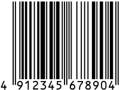
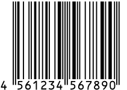
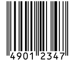
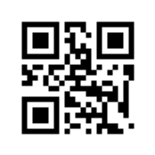
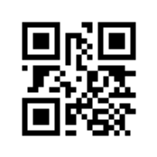
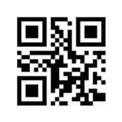

# バーコード & QRコードメモ

- [バーコード & QRコードメモ](#バーコード--qrコードメモ)
- [コードの種類](#コードの種類)
  - [JAN](#jan)
  - [CODE128](#code128)
- [ブラウザでバーコード](#ブラウザでバーコード)

# コードの種類

どうもコード方式と表現方式がごっちゃになって記述されることが多いみたいので注意が必要(両方を兼ねてる言い方もあるのがますますややこしい)。

## JAN

- 標準タイプ(13桁)
  - 7桁JAN企業コード
    1. JAN 企業コード(7桁)
    2. 商品アイテムコード(5桁)
    3. チェックデジット(1桁)
  - 9桁JAN企業コード
    1. JAN 企業コード(9桁)
    2. 商品アイテムコード(3桁)
    3. チェックデジット(1桁)
- 短縮タイプ(8桁)
   1. JAN 企業コード(6桁)
   2. 商品アイテムコード(1桁)
   3. チェックデジット(1桁)

参考: [JAN | バーコード講座 | キーエンス](https://www.keyence.co.jp/ss/products/autoid/codereader/basic_jan.jsp)

サンプル
- 4912345678904 
- 4561234567890
- 49012347

 

それをQRコードにしたもの ([QRコードの作成｜バーコードどころ](https://barcode-place.azurewebsites.net/Barcode/qr)で作成)

 

なんでQRコードなのwは秘密だ。

## CODE128

> CODE128は、アスキーコード128文字（数字、アルファベット大文字/小文字、記号、制御コード）全てをバーコード化することができます。

[CODE128 | バーコード講座 | キーエンス](https://www.keyence.co.jp/ss/products/autoid/codereader/basic_code128.jsp)

ASCIIコードなんでも、とはいうものの具体的な例としては
- [Code 128 Barcode Examples](https://www.computalabel.com/m/c128examplesM.htm)

他、参考: [Code 128 - Wikipedia](https://en.wikipedia.org/wiki/Code_128)

Code128のスタートコードにCODE-Cを使った
[GS1-128](https://www.keyence.co.jp/ss/products/autoid/codereader/basic-gs1.jsp)のサンプル:

04912345123459(10)ABC123.png "(01)04912345123459(10)ABC123")

(01)04912345123459(10)ABC123

# ブラウザでバーコード

- [ブラウザでバーコード/QRコードリーダー【実装・カスタマイズ編】 - Qiita](https://qiita.com/mm_sys/items/6e5e927ef75ab82fa8d3)
- [GitHub - andrastoth/webcodecamjs: Demo page](https://github.com/andrastoth/webcodecamjs)
  - [GitHub - EddieLa/JOB: A Barcode scanner capapable of reading Code128, Code93, Code39, Standard/Industrial 2 of 5, Interleaved 2 of 5, Codabar and EAN-13 barcodes in javascript.](https://github.com/EddieLa/JOB) - JANコードのデコードができない
  - [GitHub - LazarSoft/jsqrcode: Javascript QRCode scanner](https://github.com/LazarSoft/jsqrcode)
- [スマフォカメラにブラウザからアクセス - Qiita](https://qiita.com/tkyko13/items/1871d906736ac88a1f35)

> スマフォブラウザからカメラを利用するときはsslじゃないとだめらしいです