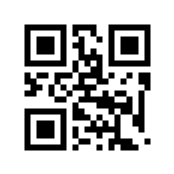
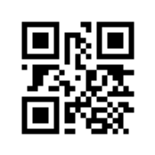
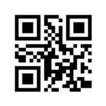

# バーコード & QRコードメモ

## JAN

- 標準タイプ(13桁)
  - 7桁JAN企業コード
    1. JAN 企業コード(7桁)
    2. 商品アイテムコード(5桁)
    3. チェックデジット(1桁)
  - 9桁JAN企業コード
    1. JAN 企業コード(9桁)
    2. 商品アイテムコード(3桁)
    3. チェックデジット(1桁)
- 短縮タイプ(8桁)
   1. JAN 企業コード(6桁)
   2. 商品アイテムコード(1桁)
   3. チェックデジット(1桁)

サンプル
- 4912345678904 
- 4561234567890
- 49012347

それをQRコードにしたもの ([QRコードの作成｜バーコードどころ](https://barcode-place.azurewebsites.net/Barcode/qr)で作成)

 

なんでQRコードなのwは秘密だ。

## CODE128