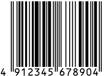
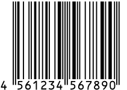
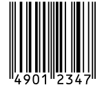

# バーコード & QRコードメモ

- [バーコード & QRコードメモ](#バーコード--qrコードメモ)
- [コードの種類](#コードの種類)
  - [JAN](#jan)
  - [CODE128](#code128)
- [ブラウザでバーコード](#ブラウザでバーコード)

# コードの種類

## JAN

- 標準タイプ(13桁)
  - 7桁JAN企業コード
    1. JAN 企業コード(7桁)
    2. 商品アイテムコード(5桁)
    3. チェックデジット(1桁)
  - 9桁JAN企業コード
    1. JAN 企業コード(9桁)
    2. 商品アイテムコード(3桁)
    3. チェックデジット(1桁)
- 短縮タイプ(8桁)
   1. JAN 企業コード(6桁)
   2. 商品アイテムコード(1桁)
   3. チェックデジット(1桁)

参考: [JAN | バーコード講座 | キーエンス](https://www.keyence.co.jp/ss/products/autoid/codereader/basic_jan.jsp)

サンプル
- 4912345678904 
- 4561234567890
- 49012347

 

それをQRコードにしたもの ([QRコードの作成｜バーコードどころ](https://barcode-place.azurewebsites.net/Barcode/qr)で作成)

 

なんでQRコードなのwは秘密だ。

## CODE128

> CODE128は、アスキーコード128文字（数字、アルファベット大文字/小文字、記号、制御コード）全てをバーコード化することができます。

[CODE128 | バーコード講座 | キーエンス](https://www.keyence.co.jp/ss/products/autoid/codereader/basic_code128.jsp)

ASCIIコードなんでも、とはいうものの具体的な例としては
- [Code 128 Barcode Examples](https://www.computalabel.com/m/c128examplesM.htm)

他、参考: [Code 128 - Wikipedia](https://en.wikipedia.org/wiki/Code_128)

# ブラウザでバーコード

- [ブラウザでバーコード/QRコードリーダー【実装・カスタマイズ編】 - Qiita](https://qiita.com/mm_sys/items/6e5e927ef75ab82fa8d3)
- [GitHub - andrastoth/webcodecamjs: Demo page](https://github.com/andrastoth/webcodecamjs)