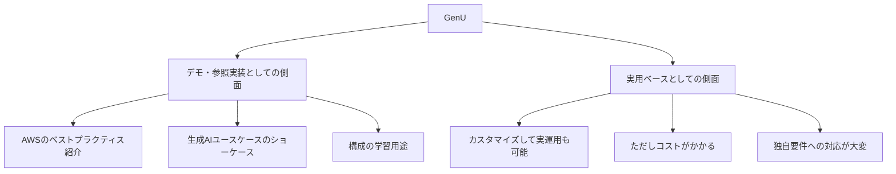

# GenUについて

おっしゃる通り、GenUは**デモ・サンプル的な側面が強い**部分があります。

## GenUの位置づけ

## 実用化の課題

| 課題             | 内容                                   |
| ---------------- | -------------------------------------- |
| **カスタマイズ** | UIや機能を業務要件に合わせる必要がある |
| **認証・認可**   | Cognitoの設定、社内IdPとの連携など     |
| **コスト管理**   | Bedrock利用料が予想外に膨らむケースも  |
| **セキュリティ** | 社内データ・ガバナンスへの対応         |
| **保守性**       | AWSがアップデートすると追従が必要      |

## 実態としては…

- ✅ **PoC・検証用途** → かなり使いやすい
- ✅ **構成の参考** → 非常に参考になる
- ⚠️ **そのまま本番投入** → 要件次第でかなり大変
- ❌ **大規模エンタープライズ** → 作り直した方が早いことも

---

**結論としては「出発点としては優秀だが、実用化には相応の工数が必要」** という感じでしょうか。

具体的にどんな用途で検討されていますか？
