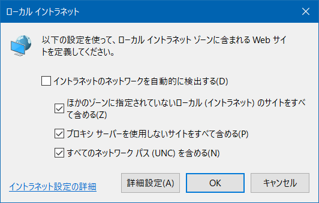
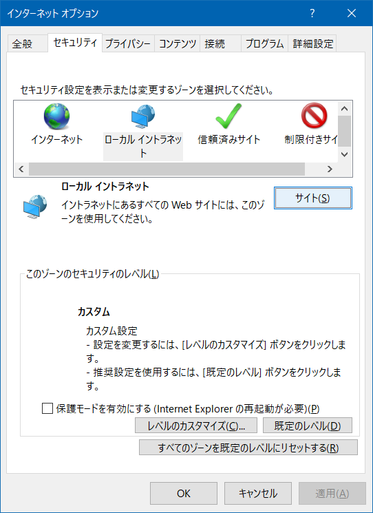

Internet Explorer (IE)のメモ。

# ローカル イントラネットゾーンはどう決まるのか

> 信頼済みサイトや制限付きサイトゾーンと同様、"ローカル イントラネットゾーン" に明示的に追加されているサイトは、問答無用でローカル イントラネットゾーンと判定されます。

[IE のセキュリティ ゾーンについて – Japan IE Support Team Blog](https://blogs.technet.microsoft.com/jpieblog/2016/05/27/ie-securityzone/)

そうでない場合のフローチャートは
https://msdnshared.blob.core.windows.net/media/2018/03/IESecurityZone.pdf

(MSはよく消えるので、用心のため[ローカルコピー](./imgs/IESecurityZone.pdf))

ここで出てくる
- イントラネットのネットワークを自動的に検出する
  - ほかのゾーンに指定されていないローカル(イントラネット)のサイトをすべて含める
  - プロキシサーバーを使用しないサイトをすべて含める
  - すべてのネットワークパス(UNC) を含める

は、これ

これは、
1. [インターネット オプション] を開き、[セキュリティ] タブを表示します
2. [ローカル イントラネット] アイコンをクリックし、[サイト] ボタンをクリックします。

で、表示する。

なんとなく「イントラネットのネットワークを自動的に検出する」をOFFにすれば
ほかのオプションも無効になるように見えるところが恐ろしい。

[前述のフローチャート](https://msdnshared.blob.core.windows.net/media/2018/03/IESecurityZone.pdf)
を熟読すること。

フローチャートの途中で出てくる「クライアント」はWWWサーバのことらしい。
(例:「クライアントがドメインネットワーク上に存在する」)

フローチャートの途中で出てくるNLA(Network Location Awareness)が難しい。
[ASCII.jp：Windowsでネットワークの状況を識別するNetwork Location Awarenessとネットワークプロファイル｜Windows Info](http://ascii.jp/elem/000/001/734/1734489/)で「管理されている(managed)」なものがイントラネットになる。
