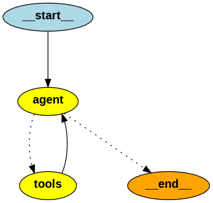

# LangGraph のメモ

## pre-built と scratch の ReAct エージェント

- [How to use the pre-built ReAct agent](https://langchain-ai.github.io/langgraph/how-tos/create-react-agent/)
- [How to create a ReAct agent from scratch](https://langchain-ai.github.io/langgraph/how-tos/react-agent-from-scratch/)

どうみても pre-built の方が簡単なんだけど、

> ここから始めてすぐにエージェントを作るのも良いのですが、
> LangGraph をフルに活用できるように、独自のエージェントの作り方を学ぶことを強くお勧めします。

とか書いてあるので scratch の方も学ばないといけない感じ。

## LangGraph 0.3 から create_react_agent は

別モジュールになって
`pip install langgraph-prebuilt`
が要るらしい。

[langgraph-prebuilt · PyPI](https://pypi.org/project/langgraph-prebuilt/)

```python
from langgraph.prebuilt import create_react_agent
```

## ReAct パターン の基礎

- 「考える」「行動する」「観察する」の 3 つのステップを繰り返す
  - 最初に問題を理解し、解決方法を考える (Thought)
  - 次に、考えた解決方法を実行する (Action)
  - 行動の結果を観察し、新たな情報を得る (Observation)
  - 得た情報を基に、再び考えて次の行動を決める
- この繰り返しで、複雑な問題も解決できる

[[2210.03629] ReAct: Synergizing Reasoning and Acting in Language Models](https://arxiv.org/abs/2210.03629)

下の図は
[How to migrate from legacy LangChain agents to LangGraph | 🦜️🔗 LangChain](https://python.langchain.com/docs/how_to/migrate_agent/)
の LangGraph pre-built 版の ReAct エージェント。



この図で ReAct の 3 要素がどこにあたるかというと

- Thought: agent ノードが、LLM が思考し、次のアクションを決定する(点線のとこ)部分に該当します。
- Action: tools ノードが、LLM が選択したツールを実行する部分に該当します。
- Observation: tools ノードから agent ノードに戻る矢印が、ツール実行の結果（Observation）を LLM にフィードバックする流れを示しています。
