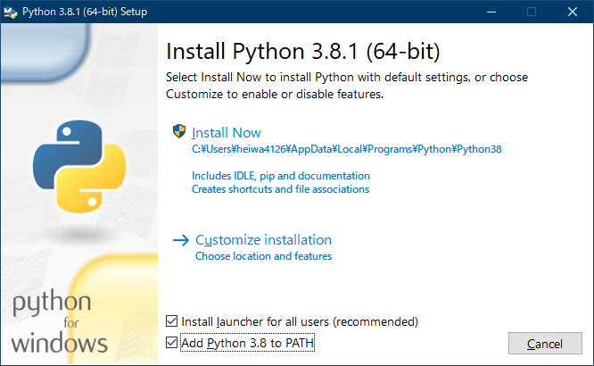

# pythonのメモ

検索すれば出てくるけど、毎回探すのは面倒なのでまとめておく。

- [pythonのメモ](#pythonのメモ)
- [pythonをインストールする(2019-12)](#pythonをインストールする2019-12)
  - [Amazon Linux 2](#amazon-linux-2)
  - [Ubuntu 18.04 TLS](#ubuntu-1804-tls)
  - [RHEL7, CentOS7](#rhel7-centos7)
  - [RHEL8, CentOS8](#rhel8-centos8)
  - [Windows python本家の配布](#windows-python本家の配布)
  - [Anaconda, miniconda](#anaconda-miniconda)
  - [Windows msys2](#windows-msys2)
  - [Windows Store](#windows-store)
- [Jupyter notebook](#jupyter-notebook)
- [pipをユーザーローカルに入れる](#pipをユーザーローカルに入れる)
- [pip --user のパス](#pip---user-のパス)
- [古いパッケージを見つける](#古いパッケージを見つける)
- [pipで更新可能なものをすべて更新するスクリプト](#pipで更新可能なものをすべて更新するスクリプト)
- [vscodeとpipenv](#vscodeとpipenv)
- [RHEL7にpip](#rhel7にpip)
- [RHEL6にpip](#rhel6にpip)
- [pip10問題](#pip10問題)
- [magic](#magic)
- [Ubuntu 18.04 LTSでpython3.7](#ubuntu-1804-ltsでpython37)
- [Ubuntu 20.04](#ubuntu-2004)
- [venv](#venv)
- [pythonのEOL](#pythonのeol)
- [モジュールとパッケージ](#モジュールとパッケージ)
- [Windows10上でのPython](#windows10上でのpython)
- [Jupyter Notebookのtips](#jupyter-notebookのtips)
- [2020-resolver](#2020-resolver)
- [WARNING: pip is being invoked by an old script wrapper.](#warning-pip-is-being-invoked-by-an-old-script-wrapper)
- [ubuntu20.04LTS以降でpythonをpython3にする](#ubuntu2004lts以降でpythonをpython3にする)
- [Python Static Analysis Tools](#python-static-analysis-tools)
- [emacsでLSPでpython](#emacsでlspでpython)
- [vscodeでpylance使うときに](#vscodeでpylance使うときに)
- [pythonのregexにPCREの\Q...\E的なもの](#pythonのregexにpcreのqe的なもの)
- [black](#black)
- [black + flake8](#black--flake8)
- [nose](#nose)
- [ローカルタイムゾーンを得る](#ローカルタイムゾーンを得る)
- [~/.config/flake8サンプル](#configflake8サンプル)
- [PyFlakes](#pyflakes)
- [fleak8](#fleak8)
- [コードレビューもどき](#コードレビューもどき)
- [pythonにタイプヒント](#pythonにタイプヒント)


# pythonをインストールする(2019-12)

システムワイドにpython3と、
新し目のpip3をuser install directoryに
インストールする手順。

## Amazon Linux 2

RHEL7同様python3が公式に配布されるようになった。いまのところpython3.7。

``` sh
sudo yum install python3
```

pip3
``` sh
pip3 intsall -U --user pip
```
デフォルトでは
`$HOME/.local/bin`のパスの優先順が低いので、
.bash_profileを修正する。

オリジナル
```
PATH=$PATH:$HOME/.local/bin:$HOME/bin
```

修正後
```
PATH=$HOME/.local/bin:$HOME/bin:$PATH
```

テスト
```
$ python3 --version
Python 3.7.4
$ pip3 --version
pip 19.3.1 from /home/xxxxx/.local/lib/python3.7/site-packages/pip (python 3.7)
```

## Ubuntu 18.04 TLS

最初からpython3 (3.6)が入っているはず。もしなければ

``` sh
sudo apt install python3
```

pip3
``` sh
pip3 intsall -U --user pip
```

デフォルトでは
`$HOME/.local/bin`のパスがないので、
~/.profileを修正する。

追加例
```
# set PATH so it includes user's private bin if it exists
if [ -d "$HOME/.local/bin" ] ; then
  PATH="$HOME/.local/bin:$PATH"
fi
```

テスト
```
$ python3 --version
Python 3.6.9
$ pip3 --version
pip 19.3.1 from /home/xxxxx/.local/lib/python3.6/site-packages/pip (python 3.6)
```

Ubuntuでは公式にPython 3.7と3.8も配布されているが、システム標準のPython3にはできない。
venvなどで使うか、バージョンを明示して使う。

Ubuntu 20.04 LTSからはPython3が標準のpythonになる予定

ほか参考:
- [（備忘録）Ubuntu 18.04 LTS で Jupyter Notebook 環境構築 - Qiita](https://qiita.com/zono_0/items/49eb8605ef4d841b2c26)


## RHEL7, CentOS7

python3が公式に配布されるようになった。いまのところpython3.6。

``` sh
sudo yum install python3
```

pip3
``` sh
pip3 intsall -U --user pip
```
デフォルトでは
`$HOME/.local/bin`のパスの優先順が低いので、
.bash_profileを修正する。

オリジナル
```
PATH=$PATH:$HOME/.local/bin:$HOME/bin
```

修正後
```
PATH=$HOME/.local/bin:$HOME/bin:$PATH
```

テスト
```
$ python3 --version
Python 3.6.8
$ pip3 --version
pip 19.3.1 from /home/xxxxx/.local/lib/python3.6/site-packages/pip (python 3.6)
```

## RHEL8, CentOS8

pythonはデフォルトでは入らない。
pythonで書かれたシステムパッケージは、ユーザが`python`と叩いて使うpythonとは別パッケージになっていてる。

システムが使うPythonは
```
# /usr/libexec/platform-python --version
Python 3.6.8
# rpm -qf /usr/libexec/platform-python
platform-python-3.6.8-15.1.el8.x86_64
```
である。

ユーザが使うPython3とpip3のインストールは
``` sh
sudo yum install python36
pip3 intsall -U --user pip
hash -r
```

テスト
```
$ python3 --version
Python 3.6.8
$ pip3 --version
pip 19.3.1 from /home/xxxxx/.local/lib/python3.6/site-packages/pip (python 3.6)
```

`python`でpython3を使うようにしたい場合は
```
$ sudo update-alternatives --config python

There are 2 programs which provide 'python'.

  Selection    Command
-----------------------------------------------
*+ 1           /usr/libexec/no-python
   2           /usr/bin/python3

Enter to keep the current selection[+], or type selection number:
```
で`/usr/bin/python3`を選ぶ。


## Windows python本家の配布

[Download Python | Python.org](https://www.python.org/downloads/)

注: たぶんすぐ直ると思うけど、jupyterはいまのところ3.8では動かない(asynioの引数がかわったらしい) ので、jupyter notebookを使うつもりなら3.7をインストール。

インストーラに従う。



インストール後「Pathの長さ制限を解除する」ボタンが出てくるので、解除する。

pip3の最新版のインストールは、管理者権限でないコマンドプロンプトから
```
pip3 install -U --user　pip
```

これは`C:\Users\ユーザ名\AppData\Roaming\Python\Python38\Scripts`にインストールされるので、
ここをPathに追加し、優先度を高くする。(Python3.7だったら38のところは37)

テスト
```
C:>python --version
Python 3.8.1

C:>pip3 --version
pip 19.3.1 from C:\Users\xxxxx\AppData\Roaming\Python\Python38\site-packages\pip (python 3.8)
```

## Anaconda, miniconda

- [Anaconda Python/R Distribution - Free Download](https://www.anaconda.com/distribution/)
- [Miniconda — Conda documentation](https://docs.conda.io/en/latest/miniconda.html)

インストール・アンインストールにすごい時間がかかるので、十分な時間的余裕をもって実行すること。

condaのパッケージ管理は、condaコマンドを使う。

たとえば、インストールされているパッケージやpython自体の更新は
インストール後、スタートメニュー->Anaconda 3->Anaconda Prompt (Anaconda 3)->右クリックで「管理者として起動」
```
conda update --all
```
で出来る。

pipでインストールすると、すぐ不具合が起きるので、
condaは「`Jupyter Notebook`環境をすぐ作りたい」というときなどに使うこと。


## Windows msys2

[MSYS2 homepage](http://www.msys2.org/)参照。たぶん使うことは少ないと思うのでTODO。


## Windows Store

Windows Storeで`python`で検索して、Python 3.8をインストール。

`C:\Program Files\WindowsApps\PythonSoftwareFoundation.Python.3.8_3.8.496.0_x64__xxxxxxxx`
のような名前でインストールされて、とてもまともに使えない。


# Jupyter notebook

Windows版ではPython3.7以下(2019-12現在。たぶんすぐ直る。[windows - Jupyter Notebook with Python 3.8 - NotImplementedError - Stack Overflow](https://stackoverflow.com/questions/58422817/jupyter-notebook-with-python-3-8-notimplementederror)参照)

python3とpip3インストール後

```sh
pip install --user -U jupyter numpy matplotlib
```
numpy と matplotlib はオマケ(グラフとか書きたいでしょう?)

```
jupyper notebook
```
で起動。
表示されるURL(`http://localhost:8888/token=xxxx`)にwebブラウザでつないで、
あとはUIに従う。


# pipをユーザーローカルに入れる

python2とpython3があって、
ディストリのパッケージでは古いpipしか入らなくて、
みたいな状況のとき
(Ubuntu 18.04LTS)

``` bash
curl -kL https://bootstrap.pypa.io/get-pip.py -O
python2 get-pip.py -U --user
python3 get-pip.py -U --user
hash -r
rm get-pip.py
```

これでpip2,pip3,pip(=pip3)が使える。

Ubuntuのデフォルトの.profileでは
`%HOME/.local/bin`が存在するときのみPATHに追加、
という仕様になってるので、(RHEL7とかでは無条件に追加)
最初の1回は

``` bash
PATH="$HOME/.local/bin:$PATH"
hash -r
```
する。

RHEL7/CentOS7では ~/.bash_profileで
``` bash
# User specific environment and startup programs
# PATH=$PATH:$HOME/.local/bin:$HOME/bin
PATH=$HOME/.local/bin:$PATH:$HOME/bin
```
`.local/bin`が先になるように修正しておく。


# pip --user のパス

```
python -c "import site; print(site.USER_BASE)"
```
この出力の/binにPATHを通せばいろいろ捗る。

参考:
- [pipに--userをつけた時のインストール先を変える - Qiita](https://qiita.com/ronin_gw/items/cdf8112b61649ca455f5)
- [29.13. site — サイト固有の設定フック — Python 3.6.5 ドキュメント](https://docs.python.jp/3/library/site.html)


# 古いパッケージを見つける

グローバルは
```
pip list --o
```
`--user`つければユーザインストール


```
pip install -U packageName
```
でアップグレード

一括アップグレードはいまのところ無いので
[pipで一括アップデート - Qiita](https://qiita.com/manji-0/items/d3d824d77c18c2f28569)
などを参考に。

参考:
- [pip で更新可能なパッケージを一覧表示 - Qiita](https://qiita.com/Klein/items/a3110d20532ba9f9057b)


# pipで更新可能なものをすべて更新するスクリプト

依存関係で問題があるかもしれない。
```
#!/bin/bash
pip3 list --user --outdated --format=freeze | \
  grep -v '^\-e' | \
  cut -d = -f 1  | \
  xargs -r -n1 pip3 install --user -U
hash -r
```

python2用はpip3をpip2にする。

`--user`でなく、システムワイドに実行するのはやめたほうがいい。
OSディストリのパッケージを消す時があるから。(certbotで失敗した)

同様の理由で`rootで--user`もやめたほうがいい。


おまけ: certbot & nginx を再インストールするapt
```
apt-get install --reinstall certbot python-certbot-nginx python3-certbot python3-certbot-nginx
```


# vscodeとpipenv

pipenvまたはvirtualenvで作業すると、グローバルやユーザにインストールした
pylintやautopep8をvscodeが見つけてくれない。

virtualenv下にpylintやautopep8をインストールすればいいのだが、
結構サイズがデカいので、
`.vscode/settings.json`で
該当バージョンのpythonに対応したパスを指定してやる。
以下は例:
```
{
    ...
    "python.linting.pylintPath": "C:\\ProgramData\\Anaconda3\\Scripts\\pylint.exe",
    "python.formatting.autopep8Path": "C:\\ProgramData\\Anaconda3\\Scripts\\autopep8.exe",
    ...
}
```

また`"python.pythonPath"`もvirtualenv下のpythonを指定する。

さらに`.vscode/settings.json`をgitに含めないようにしておく。

もっと楽な方法がありそうだがなあ。


# RHEL7にpip

最近の(2019-11)RHEL7では公式レポジトリにPython3.6が入っていて、ちょっと古めのpip3も入る。
``` bash
sudo yum install python3
```
で。


以下古い情報。

RHELはチャネル(レポジトリ)が細分化されててめんどくさい。

引用元: [How to install pip on Red Hat Enterprise Linux?](https://access.redhat.com/solutions/1519803)

```
# subscription-manager repos --enable rhel-server-rhscl-7-rpms
# yum install python27-python-pip -y
# scl enable python27 bash
# pip install --upgrade pip
```
こうすると` /opt/rh/python27/root/usr/lib/python2.7/site-packages/pip`にpipが...
どう考えても頭がおかしいと思う。

`get-pip.py`のほうが全然まともだと思う。


※ SCLについては
[ソフトウェアコレクション(SCL：Software Collections)とは？ – StupidDog's blog](http://stupiddog.jp/note/archives/1074)
等を参照。そもそもコンセプトが違う。


```
$ wget https://bootstrap.pypa.io/get-pip.py
$ python get-pip.py --user
```
あとは`$(HOME)/.local/bin`にPATHを通して`hash -r`


# RHEL6にpip

RHEL6のpythonは2.6で

> DEPRECATION: Python 2.6 is no longer supported by the Python core team, please upgrade your Python. A future version of pip will drop support for Python 2.6

とか言われますが、一応動くことは動く。

pipも9.0.3までしか入らない。

```
wget https://bootstrap.pypa.io/2.6/get-pip.py
$ python get-pip.py --user
```
あとは`$(HOME)/.local/bin`にPATHを通して`hash -r`


# pip10問題

(pip version 19以降では問題なくなりました)

* [pip install --upgrade pip (10.0.0) 後の奇妙な挙動について - 雑記](http://icchy.hatenablog.jp/entry/2018/04/17/064443)

Ubuntu16.04LTSのpython3.5でpip10に更新すると
```
$ pip
Traceback (most recent call last):
  File "/usr/bin/pip", line 9, in <module>
    from pip import main
ImportError: cannot import name main
```
こんな感じになる問題。

自分は↑のリンクを受けて
~/.profileに
```
alias pip='python3 -m pip'
alias pip3='python3 -m pip'
```
を書いていちおう解決、ということにしましたけど。

ただAWSやAzureで立てたUbuntuでは何もしないでもエラーにならなくて
よくわからない。


# magic

`magic`という名前のモジュールが何種類もあるらしい。

* [julian-r/python-magic: A python wrapper for libmagic](https://github.com/julian-r/python-magic) MIME判別用のmagic. 下のmagicのフォークだが、バイナリ付きでWindowsやMacでも動く
* [ahupp/python-magic: A python wrapper for libmagic](https://github.com/ahupp/python-magic) MIME判別用のmagic(WindowsやMacでは動かない)

他にImageMagickのPythonラッパーもあって
[Develop @ ImageMagick](http://www.imagemagick.org/script/develop.php#python)
ますますわけがわからない。


# Ubuntu 18.04 LTSでpython3.7

3.8もあるけどAzure Functionsが3.7.x対応なので一応。

rootで
```sh
apt install python3.7 python3.7-dev
```

python3を3.7にすると動かなくなるシステムツールが山ほどあるので
あんまりいじるのはやめておく。

python3-aptパッケージのこのへんが
```
/usr/lib/python3/dist-packages/apt_pkg.cpython-36m-x86_64-linux-gnu.so
/usr/lib/python3/dist-packages/apt_pkg.pyi
```
36用なので。

venvとか使うしかない。

Ubuntu 20.04 LTSでは Python 3.8が標準でPython2は入らないらしい。

# Ubuntu 20.04

`python-is-python3`という名前のパッケージがあって、
これをインストールすると`python`が`python3`になる。

(実態はsymlink)


# venv

[venv --- 仮想環境の作成 — Python 3.7.5 ドキュメント](https://docs.python.org/ja/3.7/library/venv.html)

Ubuntu 18.04 LTSで

```sh
sudo apt install python3.7 python3.7-dev python3.7-venv
python3.7 -m venv ~/.venv/37
. ~/.venv/37/bin/activate
python --version
python3 --version
pip install -U pip
deactivate
```

activateをエリアスにしておくといいかも
```
alias p37='source "$HOME/.venv/37/bin/activate"'
```
こんな感じ?

他venvのtips:
```
python3.7 -m venv ~/.venv/37 --clear
```
で、環境を作り直す。


この環境で`pip --user`するとどうなるのか?

# pythonのEOL

- [PEP 494 -- Python 3.6 Release Schedule | Python.org](https://www.python.org/dev/peps/pep-0494/#lifespan)
- [PEP 537 -- Python 3.7 Release Schedule | Python.org](https://www.python.org/dev/peps/pep-0537/#lifespan)
- [PEP 569 -- Python 3.8 Release Schedule | Python.org](https://www.python.org/dev/peps/pep-0569/#lifespan)

| version    | date    |
| ---------- | ------- |
| Python 3.6 | 2021-12 |
| Python 3.7 | 2023-06 |
| Python 3.8 | 2024-08 |


今後はAWS Lambdaは3.8で書く

- [AWS Lambda now supports Python 3.8](https://aws.amazon.com/jp/about-aws/whats-new/2019/11/aws-lambda-now-supports-python-3-8/)
- [AWS Lambda で Python 3.8 ランタイム がサポートされました ｜ Developers.IO](https://dev.classmethod.jp/cloud/aws/aws_lambda_support_python38/)


# モジュールとパッケージ

[6. モジュール — Python 3.8.1 ドキュメント](https://docs.python.org/ja/3/tutorial/modules.html)
に書いてあるとおりなので必ず読むこと。

ものすごい適当なまとめ:

- モジュールは*.pyファイル。
- パッケージはディレクトリで、`__init.py__`が必須。
  - ディレクトリに複数のモジュールを置けて、これを「サブモジュール」と呼ぶ。
  - `__init.py__`だけで、他のファイルは置かなくても良い。
  - `__init.py__`は、中身がなくてもよい(size=0)。
  - パッケージのディレクトリは階層化できる(それぞれに`__init.py__`は必要)。

[5. インポートシステム — Python 3.8.1 ドキュメント](https://docs.python.org/ja/3/reference/import.html)

「名前空間パッケージ(Namespace Packages)」

[Python にまつわるアイデア： Python のパッケージとモジュールの違い - Life with Python](https://www.lifewithpython.com/2018/05/python-difference-between-package-and-module.html)


# Windows10上でのPython

Anacondaより、本家Pythonの配布が良い感じ(2020-01現在)。

[Download Python | Python.org](https://www.python.org/downloads/)

Jupyterのバグ回避で3.7を使ってる。

- proxyやZScalerのネットワークシステムまわりで、設定が不要。
  - Anacondaだとめちゃめちゃ苦労した
- Mathplotもpipですんなり入る。

# Jupyter Notebookのtips

- [Jupyter Notebook で Prompt の番号をリセットするたったひとつの冴えたやりかた - Qiita](https://qiita.com/iktakahiro/items/32d65ebee6b7d784eed1)

# 2020-resolver

```sh
mkdir -p ~/.config/pip
echo "
[install]
use-feature=2020-resolver
" >> ~/.config/pip/pip.conf
```

2020-12ごろ

> WARNING: --use-feature=2020-resolver no longer has any effect, since it is now the default dependency resolver in pip. This will become an error in pip 21.0.

とか言い出したので `~/.config/pip/pip.conf`の該当行をコメントアウトした。


# WARNING: pip is being invoked by an old script wrapper.

[ImportError in system pip wrappers after an upgrade · Issue #5599 · pypa/pip · GitHub](https://github.com/pypa/pip/issues/5599)

要は`pip`じゃなくて`python3 -m pip`を使え、ということらしいけどめんどくさい...

aliasにするとか
```sh
#!/bin/sh -xe
PIP="python3 -m pip"
$PIP install --user -U pip
```
こんな感じで。

# ubuntu20.04LTS以降でpythonをpython3にする

```sh
sudo apt install python-is-python3
```

参考:
[Ubuntu – パッケージ検索結果 -- python-is-python3](https://packages.ubuntu.com/search?keywords=python-is-python3&searchon=names)

逆に
`python-is-python2-but-deprecated`
というパッケージもある。

あと標準だとpipも入ってない。
```
sudo apt install python3-pip
```

開発するなら
```sh
pip install --user 'python-language-server[all]'
```
など。

参考:
- [Python (Palantir) - LSP Mode - LSP support for Emacs](https://emacs-lsp.github.io/lsp-mode/page/lsp-pyls/)
- [GitHub - palantir/python-language-server: An implementation of the Language Server Protocol for Python](https://github.com/palantir/python-language-server)

自分はフォーマッタはblackが楽で好きなので
```
pip install --user black pyls-black
```

# Python Static Analysis Tools

pyflakes
pycheckers
pyre
(TODO) pyreおもしろそう。


# emacsでLSPでpython

2021-04ぐらい。Python2は考えない。
emacs >= 26.1 で。
これより低かったら、いろいろ悩むよりは
snapでemacs 27がかんたんにインストールできるので、そっちを使う。
`sudo snap install emacs --classic`

pythonのLSP、
[Languages - LSP Mode - LSP support for Emacs](https://emacs-lsp.github.io/lsp-mode/page/languages/)
には4つリストされているけど、pylsを使う例。

- [Python (Palantir) - LSP Mode - LSP support for Emacs](https://emacs-lsp.github.io/lsp-mode/page/lsp-pyls/)
- [GitHub - palantir/python-language-server: An implementation of the Language Server Protocol for Python](https://github.com/palantir/python-language-server)


自分はフォーマッタはblackが楽で好きなので
```sh
pip3 install --user -U 'python-language-server[all]' black pyls-black
hash -r
```

`~/.local/bin/pyls`ができて、パスが通ってることを確認(`which pyls`とかで)。

pylsは古い、って言われるようになった。
```sh
pip3 install --user -U python-lsp-server python-lsp-black
```

emacsの設定は`~/.emacs.d`式で。

```sh
mkdir ~/.emacs.d/elpa/gnupg -p --mode 0700
echo "keyserver hkp://keys.gnupg.net" > ~/.emacs.d/elpa/gnupg/gpg.conf
gpg --homedir ~/.emacs.d/elpa/gnupg --recv-keys 066DAFCB81E42C40
```
(gpgの`--keyserver`オプションでもいいかも。
`gpg --keyserver hkp://keys.gnupg.net ...`)


で、`emacs -q ~/.emacs.d/init.el`

```lisp
(require 'package)
;; package-archivesを上書き
(setq package-archives
      '(("melpa" . "https://melpa.org/packages/")
        ("melpa-stable" . "https://stable.melpa.org/packages/")
        ("org" . "https://orgmode.org/elpa/")
        ("gnu" . "https://elpa.gnu.org/packages/")))
(package-initialize)

(setq custom-file (expand-file-name "custom.el" user-emacs-directory))
(when (file-exists-p custom-file)
  (load custom-file))

(line-number-mode t)
(column-number-mode t)
(require 'paren) (show-paren-mode t)
(save-place-mode 1)
(prefer-coding-system 'utf-8)
(setq save-place-file "~/.emacs.d/.emacs-places")
(setq next-line-add-newlines nil)
(put 'narrow-to-region 'disabled nil)
(add-hook 'before-save-hook 'delete-trailing-whitespace)
(setq-default show-trailing-whitespace t)

(setq-default tab-width 2 indent-tabs-mode nil)
(define-key esc-map "g" 'goto-line)   ;; \M-g で 指定行へジャンプ

;; completion
(setq completion-ignore-case t)

;; python LSP mode
(add-hook 'python-mode-hook #'lsp)
(add-hook 'before-save-hook 'lsp-format-buffer 'append)
重要なのは最後の3行だけ。


emacsたちあげて

`M-x package-refresh-contents`
`M-x package-install[ret] lsp-ui[ret]`

これでOK.

他flycheckとかお好みで入れる。
`pip3 install --user --upgrade pyflakes flake8`
`M-x package-install[ret] flycheck-pyflakes[ret]`


# bytesとbytearray

- [bytes - 組み込み型 — Python 3.9.4 ドキュメント](https://docs.python.org/ja/3/library/stdtypes.html#bytes)
- [bytearray - 組み込み型 — Python 3.9.4 ドキュメント](https://docs.python.org/ja/3/library/stdtypes.html#bytearray)

> bytearray オブジェクトは可変なので、 bytes と bytearray の操作 で解説されている bytes オブジェクトと共通の操作に加えて、 mutable シーケンス操作もサポートしています。

[ミュータブルなシーケンス型 - 組み込み型 — Python 3.9.4 ドキュメント](https://docs.python.org/ja/3/library/stdtypes.html#typesseq-mutable)

例:
```python
b1 = b"b\x00\x01\x02"  # bytes
b2 = bytearray(b1)     # bytearray

print(b2)
b2[1] = 0x11  # bytearrayはmutable
print(b2)

print(b1)
b1[1] = 0x11  # raise TypeError: 'bytes' object does not support item assignment
print(b1)
```

# vscodeでpylance使うときに

settings.jsonに
```json
{
    "python.languageServer": "Pylance",
    "python.analysis.typeCheckingMode": "basic"
}
```

表示されるルール一覧はここに
[pylance-release/DIAGNOSTIC_SEVERITY_RULES.md at main · microsoft/pylance-release · GitHub](https://github.com/microsoft/pylance-release/blob/main/DIAGNOSTIC_SEVERITY_RULES.md)


# pythonのregexにPCREの\Q...\E的なもの

PCREには\Q...\Eではさむとメタ文字が意味を失う、というのがあって
> If you want to remove the special meaning from a sequence of characters, you can do so by putting them between \Q and \E
[pcrepattern specification](https://www.pcre.org/original/doc/html/pcrepattern.html)

`re.escape(pattern)`で。


# black

[psf/black: The uncompromising Python code formatter](https://github.com/psf/black)

無設定で使える。

たぶん行の最大長だけは変えたほうがいい(88)。
[The Black code style — Black 21.7b0 documentation](https://black.readthedocs.io/en/stable/the_black_code_style/current_style.html#line-length)


# black + flake8


[Using Black with other tools — Black 21.7b0 documentation](https://black.readthedocs.io/en/stable/guides/using_black_with_other_tools.html?highlight=E203#flake8)


# nose

`nosetests`がテストファイルを見つけてくれないとき。

[python \- Nose unable to find tests in ubuntu \- Stack Overflow](https://stackoverflow.com/questions/1457104/nose-unable-to-find-tests-in-ubuntu)

executableだとスキップされます。

トラブルシューティングには
```sh
nosetests -vv --collect-only
```
が便利


# ローカルタイムゾーンを得る

pythonスクリプトの動いているホストのローカルタイムゾーンを得る。

[datetime - Python: Figure out local timezone - Stack Overflow](https://stackoverflow.com/questions/2720319/python-figure-out-local-timezone)

```python
from datetime import datetime,timezone
LOCAL_TIMEZONE = datetime.now(timezone.utc).astimezone().tzinfo
```

# ~/.config/flake8サンプル

```
[flake8]
max-line-length = 166
# ignore = E203, E266, E501, W503, F403, F401, E999
ignore = E203, E266, E501, W503, F403, F401
select = B,C,E,F,W,T4,B9
```

# PyFlakes

[PyCQA/pyflakes: A simple program which checks Python source files for errors](https://github.com/PyCQA/pyflakes)


# fleak8

[PyCQA/flake8: flake8 is a python tool that glues together pycodestyle, pyflakes, mccabe, and third-party plugins to check the style and quality of some python code.](https://github.com/PyCQA/flake8)

```
Flake8 is a wrapper around these tools:

PyFlakes
pycodestyle
Ned Batchelder's McCabe script
```

McCabe? 循環的複雑度?

- [PyCQA/mccabe: McCabe complexity checker for Python](https://github.com/PyCQA/mccabe)
- [McCabe 循環的複雑度 | Rogue Wave - Documentation](https://docs.roguewave.com/jp/klocwork/current/mccabecyclomaticcomplexity)

よくわからないけどネストが深いと警告してくれる、ってことかな...


# コードレビューもどき

オートフォーマッタを使いましょう。
おすすめ: black (psf/black)
 
lintを使いましょう。
おすすめ: flake8 (PyCQA/flake8)
 
(TIPS: black + flake8の場合、flake8の設定に(例えば~/.config/flake8)
`ignore = E203`
だけは追加しましょう)

↑[Using Black with other tools — Black 21.9b0 documentation](https://black.readthedocs.io/en/stable/guides/using_black_with_other_tools.html)

使い方を書きましょう。
 
requirements.txtを書きましょう。
 
.gitignoreを書いて __pycache__ などはgitから除外しましょう。
 
pyflakesなどで未使用のimportを検出しましょう。
 
ローカルなモジュールはサブディレクトリを作ってその下に置きましょう。

例)
```
gencacert/app/crypt.py ->　gencacert/app/lib/crypt.py
んで
from crypt import AESCipher -> from lib.crypt import AESCipher
とする
```

コマンドラインからパラメータを受け取るなら DIっぽくモジュール解析部分と、関数本体を分けましょう。
 
docstringはなるべく書きましょう。
 
ネストは深くならないようにしましょう。 Pythonのインデントが4だったり、max-line-lengthが80や88などだったりするのはそれなりに意味があります。
 
定数を形だけでもいいからなるべく外出しにしましょう。
 
デプロイ方法を書きましょう。
 
モジュールでないCLIから実行するコードには、shebang書いて、実行権限もつけましょう。


# pythonにタイプヒント

[typing --- 型ヒントのサポート — Python 3.10.0b2 ドキュメント](https://docs.python.org/ja/3/library/typing.html)

型ヒント書くと補完が効くので便利なんだけど、
ちょっと複雑になるともう手に負えないのが欠点。GoLangがどれだけ偉大かわかる。

んで例えばboto3の場合

* [alliefitter/boto3_type_annotations: Deprecated. A maintained fork is available at https://github.com/vemel/mypy_boto3](https://github.com/alliefitter/boto3_type_annotations)
* [boto3\-stubs · PyPI](https://pypi.org/project/boto3-stubs/)
* [boto3\-stubs を使って、boto3 でコード補完を有効にしよう \- Qiita](https://qiita.com/smatsumt/items/5235bcd794e634153982)

でも全然効かない...
