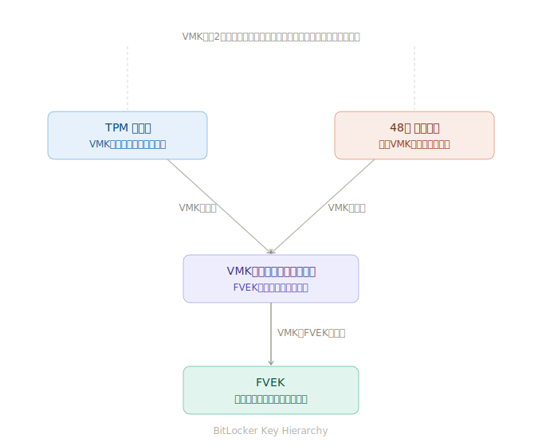

# TPM(Trusted Platform Module) のメモ

## かなり雑なFAQ

「これは別」とか「領域による」とかあるので...

- TPMはHSM(Hardware Security Module)の廉価版
  - TPMは用途特化・組み込み向けセキュアエレメント、とは言える
- デバイス、またはI2Cなどを使ってTPMにコマンドとデータを送ると結果が帰ってくる
- TPM内部には不揮発性のメモリがある
- TPM内部のメモリはバックアップはできない。意図的にできないようになっている
- 規格としての TPM 1.x と TPM 2.0 には互換性がない
- ハードウエアとして TPM 1.x と 2.0を併せ持つものはけっこう存在して、ファームウェア更新やBIOSで切り替えられる。ただし「同時に対応」は無い

## チュートリアル

[TPM\-JS](https://google.github.io/tpm-js/#pg_introduction)

> TPMはマザーボードに半田付けされた独立したデバイスです。製造コストが1ドル未満の安価なローエンドデバイスであり、低速で低帯域幅のチャネルを介してメインCPUと通信します。

> TPMは受動的なデバイスであり、システムを監視したり、CPUの実行を停止させたりすることはできません。動作させるには、データを与える必要があります。

> TPMは、実行時状態と永続データのためのストレージ容量が限られています。不揮発性ストレージのサイズは約64KBです。TPMは同時に保持できるオブジェクト数も限られています。そのため、ホスト上の専用ソフトウェア層(リソースマネージャ)が、実行時にセッションオブジェクトのロードとアンロードを行います。

> TPMコマンドの実行はシングルスレッドで行われます。つまり、一度に1つのコマンドしか実行されません。コマンドをキューに追加したり、まとめて実行したりすることはできません。各コマンドは、現在実行中のコマンドが終了するまで待機する必要があります。なお、コマンドの実行はキャンセルできます。

## Remote System Attestation 機能

TPMのSecure Key Generation 機能はわかりやすい。
Remote System Attestation 機能とは何?

Remote System Attestation = 「そのマシンが改ざんされてない状態で起動している」ことを遠隔から証明する仕組み」

## Bitlocker について

- [BitLocker の概要 | Microsoft Learn](https://learn.microsoft.com/ja-jp/windows/security/operating-system-security/data-protection/bitlocker/)
- [BitLocker の構成 | Microsoft Learn](https://learn.microsoft.com/ja-jp/windows/security/operating-system-security/data-protection/bitlocker/configure?tabs=common)
- [BitLocker FAQ | Microsoft Learn](https://learn.microsoft.com/ja-jp/windows/security/operating-system-security/data-protection/bitlocker/faq)

TPM は、

- このPCか?
- BIOS/UEFI が改変されていないか?
- Secure Boot 状態は正常か?
- 起動構成が変わっていないか?

などを確認し、問題なければ自動的に鍵を渡す(これ間違い。)

で、
TPM内の"秘密キー"と48桁回復キーの両方でデクリプトできるのは
どこかでインチキがあるような気が...

ここが
"鍵の階層構造(Key Hierarchy)"

### ポイントは「VMK」という中間の鍵

「インチキ」に見えるのは当然で、実は**同じ鍵で二通りの方法で復号しているわけではありません**。こういう構造になっています。

### 3層の鍵階層

1. **FVEK**(Full Volume Encryption Key)— ディスクのデータを実際に暗号化する鍵。これは一つしかなく、ディスクに暗号化された状態で保存されます。

2. **VMK**(Volume Master Key)— FVEKを暗号化して守る中間の鍵。これが今回の謎を解くカギです。

3. **TPM/回復キー** — VMKを復号するための手段。

暗号化されたVMK(2種類)と
暗号化されたFVEK
はボリュームの特定領域に存在する。

### なぜ2つの方法で復号できるのか?

VMKは「2つの別々の暗号化コピー」としてディスクに保存されています。

- **コピーA** → TPMの内部秘密鍵で暗号化されたVMK
- **コピーB** → 48桁回復キーから生成された鍵で暗号化されたVMK

どちらを使っても同じVMKが復元できれば、そのVMKでFVEKを復号でき、FVEKでディスクを読める、という流れです。

コピーAの方には
SRKと
PCR値が
暗号の一部に入っている。

要は
暗号化鍵を2種類の鍵で暗号化して、2種類ディスクの特定領域に書いてある
どっちの鍵でも複合できて、同じFVEKが出てくる

> ドアの鍵穴が2つあって、どちらのカギを使っても同じドアが開く、というのと同じ発想です。
> ドアの構造(FVEK)は一つですが、それを開ける手段を複数用意している。共通のVMKを異なる方法で封印しているだけで、暗号理論上の抜け穴は何もありません。

## Bitlocker To Go

[BitLocker To Go](https://learn.microsoft.com/ja-jp/windows/security/operating-system-security/data-protection/bitlocker/faq#bitlocker-to-go)

リムーバルドライブ用

固定ドライブ(特にブートディスク) では

- TPM
- 回復キー

の2本立てだったが、
BitLocker To Goの場合は

- パスワード
- 回復キー

2本立てになっている。

BitLocker To Go のパスワードはデバイス接続時に毎回必要。

[第2回 BitLocker To GoでUSBメモリやリムーバブルハードディスクを暗号化して保護する:超入門BitLocker(2/2 ページ) \- @IT](https://atmarkit.itmedia.co.jp/ait/articles/1703/01/news068_2.html)

### Windows Hello で BitLocker To Go のパスワードを不要にする

この項あやしい。あとで調べる
→
どうも Windows Hello とは無関係

「自動ロック解除」は Windows Hello とは無関係で、仕組みはこうです:

1. 有効化すると、そのPCのシステムドライブ(BitLocker で保護されたCドライブ)に、解除キーが保存される
2. 次回以降、そのUSBを同じPCに挿すと、Cドライブの鍵を使って自動的に解除される
3. Windows へのサインイン方法(Hello でも普通のパスワードでも)は関係ない

**重要: Cドライブが BitLocker で保護されていない場合、自動ロック解除は設定できません(グレーアウトされます)**

### (元の記述)

すでに BitLocker To Go (パスワード)を設定済みのUSBメモリーがある場合、以下の手順で紐付けられます。

1. USBメモリーをPCに接続します。
2. パスワードを入力して一度ロックを解除します。
3. エクスプローラーでUSBドライブを右クリックし、「BitLocker の管理」を選びます。
4. 設定画面の中にある「自動ロック解除の有効化」をクリックします。

これだけで完了です!次からは、そのPCにWindows Helloでサインインしていれば、USBを挿すだけでパスワードなしで開くようになります。

## TPMに加えて「起動時パスワード(PIN)」や「スタートアップUSBキー」を必須に設定する

OSドライブ向け。企業のPCなどでよく使われる。

- [【Windows 11便利テク】Windows起動前からBitLockerでPCを保護する方法 - PC Watch](https://pc.watch.impress.co.jp/docs/column/win11tec/1410621.html)
- [PINでBitLockerを使用する方法 | Dell 日本](https://www.dell.com/support/kbdoc/ja-jp/000142382/pin%E3%81%A7bitlocker%E3%82%92%E4%BD%BF%E7%94%A8%E3%81%99%E3%82%8B%E6%96%B9%E6%B3%95)
- [BitLocker の構成 | Microsoft Learn](https://learn.microsoft.com/ja-jp/windows/security/operating-system-security/data-protection/bitlocker/configure?tabs=os) - 詳しいけどわけがわからない
- [BitLocker FAQ | Microsoft Learn](https://learn.microsoft.com/ja-jp/windows/security/operating-system-security/data-protection/bitlocker/faq) で "スタートアップ キー" で検索
