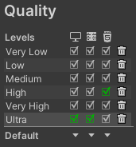
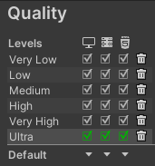

# Unity メモ

## 学習環境を作る

まず Unity Hub ではなく Visual Studio 2022 community edition をインストールする。

- [Visual Studio Tools のダウンロード - Windows、Mac、Linux 用の無料インストール](https://visualstudio.microsoft.com/ja/downloads/)
- [Visual Studio 製品の比較 | Visual Studio](https://visualstudio.microsoft.com/ja/vs/compare/)

Visual Studio インストーラーに Unity の項目があるのでそれをチェック。

参照: [クイックスタート: Visual Studio Tools for Unity のインストールと構成 | Microsoft Learn](https://learn.microsoft.com/ja-jp/visualstudio/gamedev/unity/get-started/getting-started-with-visual-studio-tools-for-unity?pivots=windows)

で、上記の手順で Unity Hub もインストールされるので、
そこから Unity Editor をインストールする。

1. Unity ID つくる。 [Unity ID](https://id.unity.com/ja/)
1. Unity Hub の右上のユーザアイコンからいま作った Unity ID でサインイン
1. Unity Hub の左の「ライセンス」を選び、「新規ライセンス」で Unity Personal (とりあえず) を選ぶ。

最新版の Unity Editor (2022.3LTS)をインストールすると、チュートリアルで使う Microgames が出てこない。
Unity Editor は複数入れられるので 2021.3LTS を入れる。

入れたモジュールは

- Microsoft Visual Studio Community 2019 は入れない 2022 で OK
- Windows Build Support (IL2CPP)
- 日本語言語パック (あんまり役に立たない)

で [Unity Learn](https://learn.unity.com/)から
`Unity Essentials` を始める。

横に「Unity バージョンを選択してください」のプルダウンがあるので
これを Editor に合わせること。

その他

Build Tools for Visual Studio 2022 も要るかもしれない。

コンソールから `dotnet --info` とタイプして、エラーにならなければ不要。

もし Build Tools for Visual Studio 2022 が要る場合は
https://visualstudio.microsoft.com/ja/downloads/
の下のほうの
`Tools for Visual Studio` を広げると
`Build Tools for Visual Studio 2022` が出てくる。

## 公式チュートリアルが 2021.3

最新版の Unity Editor(2022.3LTS)をインストールすると
Microgames が出てこない。

1. Visual Studio インストーラーで
2. Visual Studio 2022 comunity edition を Unity サポート付き でインストール
3. Unity Hub から 2021.3 エディタをインストール(Visual Studio 2019 のインストールを外して)

がいいと思う

## チュートリアルメモ

- Get started with Unity
- Welcome to Unity Essentials
-

## 選択したオブジェクトにフォーカス

- Shift+F
- 階層でダブルクリック
- 階層で F キー

## Flythrough mode

マウス右ボタンを押しっぱなし。

Digital Content Creation(DCC)ツール

## WebGL でビルドしようとすると Color Space を直せ、と言われる

> In order to build a player, go to 'Player Settings...'
> Unity Build "to resolve the incompatibility between the Color Space and the current settings."

さすがになんだかわからないので以下のリンクに従う。

[Unity:WebGL で Build ボタンが押せない「In order to build a player,go to ‘Player Settings...’ to resolve the incompatibility between the Color Space and the current settings.」エラーの対処 | 電脳産物](https://dianxnao.com/unity%EF%BC%9Awebgl%E3%81%A7build%E3%83%9C%E3%82%BF%E3%83%B3%E3%81%8C%E6%8A%BC%E3%81%9B%E3%81%AA%E3%81%84%E3%80%8Cin-order-to-build-a-playergo-to-player-settings-to-resolve-the-incompatibility/)

Player setting の Other Settings のところで Auto Graphics API の項目のチェックを外す。

## WebGL でビルドしたものを Node.js の http-server で見ようとすると

> Unable to parse Build/build.framework.js.gz! This can happen if build compression was enabled but web server hosting the content was misconfigured to not serve the file with HTTP Response Header "Content-Encoding: gzip" present. Check browser Console and Devtools Network tab to debug.

と言われる。言ってることはわかるけど...

ひとつの答えは「圧縮しない」。

File \> Publishing Settings \>
Player \> Publishing Settings \> Decompression fallback

gzip,brotli,disable から選べる。
圧縮処理けっこう時間かかるし、テストはこれがいいと思う。

普段は

- 非圧縮を設定
- "build & run" ボタン
  でいいと思う。

で、build 済みのディレクトリを使うには

- 非圧縮
- `http-server ./build` (./build にビルドした場合)

圧縮する場合は
これなんかが参考になる。
[WebGL ビルドしたコンテンツを nginx で配信する](https://egashira.dev/blog/webgl-nginx-server-conf)
結構手の込んだ設定が必要。

パブリッシュする場合はまた話が別。AWS S3 なんかだとオブジェクト単位で指定できるし。

## Unity Editor で WebGL で build すると影がでないのはなぜ?

File \> Publishing Settings \> Quarity のところで

こうなってるのを:  


こうする:  


下の ▼ ▼ ▼ の一番右をクリックするとプルダウンが出る。

Ultra でなく Very High でも影は出る。

## Unity Editor のマイナーバージョンが 1 個あがっても全部ダウンロードするのはなんとかなりませんか?

けっこうサイズ大きいし。

## 用語など

### Unity Cloud

クラウドベースの CI (continuous integration)ツール。

Unity Cloud は、Unity のクラウドベースのサービスです。
Unity でゲームやアプリケーションを開発するクリエイターが、ビルドの自動化、クラウドベースのビルド、マルチプラットフォームビルド、ビルドのテストとデバッグ、ビルドの管理などの機能を利用できるようにします。

- [Unity Cloud Build - Unity マニュアル](https://docs.unity3d.com/ja/2022.1/Manual/UnityCloudBuild.html)

### IL2CPP (Intermediate Language To C++)

[IL2CPP の概要 \- Unity マニュアル](https://docs.unity3d.com/ja/2023.2/Manual/IL2CPP.html)

> IL2CPP (Intermediate Language To C++) スクリプティングバックエンドは、Mono バックエンドの代替品です。
> IL2CPP は、広範なプラットフォームのアプリケーションに対し、優れたサポートを提供します。
> IL2CPP バックエンドは、MSIL (Microsoft Intermediate Language) コード (スクリプト内の C# コードなど) を C++ コードに変換し、その C++ コードを使って選択したプラットフォーム用のネイティブのバイナリファイル (.exe、.apk、.xap など) を作成します。

- [IL2CPP - Unity マニュアル](https://docs.unity3d.com/ja/2021.1/Manual/IL2CPP.html)
- [IL2CPP のしくみ - Unity マニュアル](https://docs.unity3d.com/ja/2021.1/Manual/IL2CPP-HowItWorks.html)
- [スクリプティングバックエンド - Unity マニュアル](https://docs.unity3d.com/ja/2023.2/Manual/scripting-backends.html)

Unity には、Mono と IL2CPP (Intermediate Language To C++) という 2 つのスクリプティングバックエンドがあり、それぞれ異なるコンパイル技術を使用しています。

- Mono はジャストインタイム (JIT) コンパイルを採用しており、実行時に必要に応じてコードをコンパイルします。
- IL2CPP は AOT (Ahead-of-Time) コンパイルを採用しており、アプリケーション全体を実行前にコンパイルします。

### URP (Unity Universal Render Pipeline)

- [ユニバーサルレンダーパイプラインの概要 | Universal RP | 14.0.2](https://docs.unity3d.com/ja/Packages/com.unity.render-pipelines.universal@14.0/manual/index.html)
- [Universal Render Pipeline overview | Universal RP | 17.0.1](https://docs.unity3d.com/Packages/com.unity.render-pipelines.universal@17.0/manual/index.html)

レンダリングパイプラインとは、3D シーンを 2D 画像に変換する一連のステップです。
レンダリングパイプラインは、基本的に、3D モデルのポリゴンデータ、テクスチャデータ、ライトデータなどの入力を受け取り、それを最終的な画像として出力します。

URP は、Unity の最新のレンダリングパイプラインであり、さまざまなプラットフォームで動作するように設計されています。

Unity には、URP 以外にも、次の 2 つのレンダリングパイプラインが用意されています。

- **High Definition Render Pipeline (HDRP)** - HDRP は、URP よりも高品質なグラフィックスを作成できるレンダリングパイプラインです。HDRP は、アーティストが細かい設定を調整できるため、より高度なグラフィックスを作成できます。
- **Legacy Render Pipeline (LP)** - LP は、Unity の古いレンダリングパイプラインです。LP は、URP や HDRP よりもパフォーマンスが向上しています。LP は、モバイル ゲームや低スペックなデバイス向けのアプリケーションに適しています。別名 **BRP(Built-in Render Pipeline)**

## Visual Studio 2022 (Visual Studio Code ではなく)で、ソースの保存時にドキュメントのフォーマットを実行するには?

(Google Bard に聞いてみました)

Visual Studio 2022 でソースの保存時にドキュメントのフォーマットを実行するには、次の手順を実行します。

1. Visual Studio 2022 を開き、保存するソース ファイルを開きます。
2. メニュー バーで、**ツール** \> **オプション** を選択します。
3. 左側のペインで、**テキスト エディター** \> **コード クリーンアップ** を選択します。
4. **保存時にコード クリーンアップ プロファイルを実行する** チェックボックスをオンにします。
5. ドロップダウン リストから、保存時に実行するコード クリーンアップ プロファイルを選択します。
6. **OK** をクリックします。

これで、ソース ファイルを保存するたびに、選択したコード クリーンアップ プロファイルに従ってドキュメントのフォーマットが実行されます。

コード クリーンアップ プロファイルとは、コードの書式設定、名前付け規則、コメントのスタイルなどのコード スタイル設定をまとめたものです。Visual Studio には、さまざまなコード クリーンアップ プロファイルが用意されています。また、必要に応じて、独自のコード クリーンアップ プロファイルを作成することもできます。

コード クリーンアップ プロファイルを作成するには、次の手順を実行します。

1. メニュー バーで、**ツール** \> **オプション** を選択します。
2. 左側のペインで、**テキスト エディター** \> **コード クリーンアップ** を選択します。
3. **コード クリーンアップ の構成** をクリックします。
4. **新しいプロファイル** をクリックします。
5. プロファイルの名前を入力し、**OK** をクリックします。

Community Edition では新規プロファイルの追加はできないみたい。
プロファイルが 2 つ入ってるので「プロファイル 2」のほうを弄ってみるといいと思う。

特に「不要な import または using の削除」はチュートリアル中にはまずいかも。

## Update()と LateUpdate()

Unity の Update()と LateUpdate()は、どちらもフレームごとに呼び出される関数ですが、その呼び出しのタイミングが異なります。

- **Update()** は、フレームの最初に呼び出されます。これは、フレームの開始時に、すべてのオブジェクトの状態を更新するために使用されます。例えば、オブジェクトの位置や回転、スケールを更新したり、アニメーションを再生したり、物理演算を実行したりするために使用されます。
- **LateUpdate()** は、Update()の後に呼び出されます。これは、Update()で実行された処理の後に、追加の処理を行うために使用されます。例えば、カメラの追跡や、物理演算の補正などに使用されます。

用途:

- Update()でオブジェクトの位置を更新し、LateUpdate()でカメラの追跡を行う
- Update()で物理演算を実行し、LateUpdate()で物理演算の補正を行う

## SerializeField

以下の場合に使う。

- C# 側で触らせたくない (public にしたくない)
- かつ、Unity Editor の inspector からは触れるようにしたい

- [Unity の[SerializeField]について色々な疑問に答えてみる #C# - Qiita](https://qiita.com/makopo/items/8ef280b00f1cc18aec91)
- [Lesson 6.1 - Project Optimization - Unity Learn](https://learn.unity.com/tutorial/lesson-6-1-project-optimization?uv=2021.3&pathwayId=5f7e17e1edbc2a5ec21a20af&missionId=5f7648a4edbc2a5578eb67df&projectId=5d092adcedbc2a0e5c02d26f#5d1bba43edbc2a001f8c0131)

## const と readonly と static readonly

[const と readonly と static readonly、それぞれの特徴と使い分け方 #C# - Qiita](https://qiita.com/4_mio_11/items/203c88eb5299e4a45f31)

## Update() と FixedUpdate() と LateUpdate()

**Update()**は、1 フレームごとに 1 回実行される関数です。フレームレートの影響を受けるため、フレームレートが低いと処理が遅くなる可能性があります。入力処理、カメラの追従、物体の動きなど、フレームレートに影響される処理に使用します。

**FixedUpdate()**は、指定したフレームレートごとに 1 回実行される関数です。フレームレートの影響を受けないため、フレームレートが低くても安定した処理を行うことができます。物理演算、回転処理、オーディオ処理など、フレームレートに影響されない処理に使用します。

**LateUpdate()**は、Update()の後に 1 回実行される関数です。フレームレートの影響を受けるため、フレームレートが低いと処理が遅くなる可能性があります。カメラの揺れ、エフェクトの追加など、Update()の処理に影響を与えないようにしたい処理に使用します。

LateUpdate() は、**すべての** Update() が呼ばれた後に実行されるため、他のスクリプトによる変更を考慮した上でオブジェクトの状態を調整するのに便利です。

- [イベント関数の実行順序 - Unity マニュアル(2018.4)](https://docs.unity3d.com/ja/2018.4/Manual/ExecutionOrder.html)
- [イベント関数の実行順序 - Unity マニュアル(2023.2)](https://docs.unity3d.com/ja/2023.2/Manual/ExecutionOrder.html)

## Awake() と Start()

**Awake()** は、ゲームオブジェクトがアクティブになったら、1 回だけ実行される関数です。Awake()は、ゲームオブジェクトのインスタンス化直後に実行されるため、ゲームオブジェクトの初期化処理に使用されます。

**Start()** は、ゲームオブジェクトがアクティブになったら、1 回だけ実行される関数です。Start()は、Awake()の後に実行されるため、Awake()で初期化したオブジェクトを参照する処理など、Awake()で初期化したオブジェクトと関連する処理に使用されます。

具体的な使い分けとしては、以下のようなものが挙げられます。

Awake()

- 変数の初期化
- コンポーネントの初期化
- 他のゲームオブジェクトへの**参照**の取得

Start()

- ゲームの初期化
- 入力の取得
- カメラの配置

## ECS (Entity Component System)

[ECS Survival Guide - Unity Learn](https://learn.unity.com/tutorial/ecs-survival-guide?uv=2021.3&pathwayId=5f7e17e1edbc2a5ec21a20af&missionId=5f7648a4edbc2a5578eb67df&projectId=5d092adcedbc2a0e5c02d26f#)

Data-Oriented Technology Stack (DOTS)

[【Unity】DOTS(ECS)が正式リリースされたので試してみた](https://zenn.dev/k41531/articles/5168cc291b4dfa)

## 壁のすり抜け

- [Unity ボールが壁をすり抜ける - Google 検索](https://www.google.co.jp/search?hl=ja&q=Unity+%E3%83%9C%E3%83%BC%E3%83%AB%E3%81%8C%E5%A3%81%E3%82%92%E3%81%99%E3%82%8A%E6%8A%9C%E3%81%91%E3%82%8B&lr=lang_ja)
- [unity avoid a ball pass through wall - Google Search](https://www.google.com/search?q=unity+avoid+a+ball+pass+through+wall&hl=en)
- [衝突の基本 - Unity マニュアル](https://docs.unity3d.com/ja/current/Manual/CollidersOverview.html)
- [CCD (連続的衝突判定) - Unity マニュアル](https://docs.unity3d.com/ja/current/Manual/ContinuousCollisionDetection.html)

Rigidbody で Collision Detection を Discrete 以外にしなければならないような場合は、そもそもゲームデザインを考えなおしたほうがいいみたい。

## "Input Manager" から "Input System" へ切り替える

古いコードを　"Input Manager" から "Input System"　へ切り替える手順は以下の通り。

パッケージマネージャーで Input System をインポート。

Project Settings の Player \> Other Settings \> Active Input Handling で
`BOTH` になってるのを確認。

"Input Manager" から "Input System" へコードを書き換える。

例:

"Input Manager" から

```C#
	void Update()
	{
		if (Input.GetKeyDown(KeyCode.Space))
		{
			SceneManager.LoadScene(1);
		}
	}
```

"Input System" へ

```C#
using UnityEngine.InputSystem;  // たぶん自動で補完される

    void Update()
    {
        if (Keyboard.current.spaceKey.wasPressedThisFrame)
        {
            SceneManager.LoadScene(1);
        }
    }
```

全部の EventSystem で
"Replace with InputSystemUIInputModule"
ボタンを押す。

参考:

- [Unity: Conflict between new InputSystem and old EventSystem - Stack Overflow](https://stackoverflow.com/questions/65027247/unity-conflict-between-new-inputsystem-and-old-eventsystem)
- [Unity の新入力システム・Input System を使おう – Unity for Pro](https://forpro.unity3d.jp/unity_pro_tips/2021/05/20/1957/)

Project Settings の Player \> Other Settings \> Active Input Handling
を `Input System Package (New)` にする。

これで Play して問題ないか確認する。

## URP にする

URP の利点がよくわからないけど URP にしてみる。

[既存のプロジェクトへのユニバーサルレンダーパイプラインのインストール | Universal RP | 14.0.2](https://docs.unity3d.com/ja/Packages/com.unity.render-pipelines.universal@14.0/manual/InstallURPIntoAProject.html)

パッケージマネージャーで "Universal RP" をインポート (時間かかる)。

Assets > Create > Rendering > Universal Render Pipeline > Pipeline Asset

最近は`Pipeline Asset`がなくて、
`URP Asset (with Universal Renderer)`選ぶ。
パイプラインとアセットの両方を作ってくれる(昔は別々に作る必要があったみたい)。
Asset の直下に Renderer フォルダ作って、そこで create するといいと思う。

マテリアルが全部ピンク色になるので、
Edit > Rendering > Materials > Convert All Built-In Materials to URP

エディタが古いと
`Convert All Built-In Materials to URP`
がないかもしれない。

かわりにマテリアルを選択ののち(複数選べる)
Edit > Rendering > Materials > Convert Selected Built-In Materials to URP

## VR

- [Create with VR - Unity Learn](https://learn.unity.com/course/create-with-vr?uv=2021.3) - プログラミングレスなコース。次の "VR Development Pathway" の一部でもある。
- [VR Development Pathway - Unity Learn](https://learn.unity.com/pathway/vr-development) - がっつりコース。きっちり更新されている

- [Create a VR Starter Project from Scratch - Unity Learn](https://learn.unity.com/tutorial/create-a-vr-starter-project-from-scratch) - VR シーンを 1 から作りたいとき

## AR Default Face からマスクを消す

"AR Face Mesh Visualizer (Script)"を無効にすれば
マスクは描画されなくなるけど、これが正しいかどうかはわからない。
