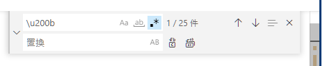

# Visual Studio Code メモ

- [Visual Studio Code メモ](#visual-studio-code-メモ)
  - [Remote Development](#remote-development)
    - [step1](#step1)
    - [step 2](#step-2)
    - [step 3](#step-3)
    - [メモ](#メモ)
  - [Powershell 7 が Windows Store で配布されるようになった](#powershell-7-が-windows-store-で配布されるようになった)
  - [Widnows11 で"Open with Code"が出ない件](#widnows11-でopen-with-codeが出ない件)
  - [ゼロ幅スペース (Zero Width Space: U+200B)](#ゼロ幅スペース-zero-width-space-u200b)
  - [bash のキーアサイン](#bash-のキーアサイン)
  - [VSCode server](#vscode-server)
  - [VScode server が CPU 100%](#vscode-server-が-cpu-100)
  - [現在 VScode にインストールされている拡張機能の ID を得るには?](#現在-vscode-にインストールされている拡張機能の-id-を得るには)
  - [VScode で Javascript/Typescript の import を並び変える](#vscode-で-javascripttypescript-の-import-を並び変える)

## Remote Development

ここから始める: [Developing on Remote Machines using SSH and Visual Studio Code](https://code.visualstudio.com/docs/remote/ssh)

使える SSH クライアントは: [Visual Studio Code Remote Development Troubleshooting Tips and Tricks](https://code.visualstudio.com/docs/remote/troubleshooting#_installing-a-supported-ssh-client)

Git for Windows に入ってる MINGW の ssh が使える。

- 開発してるなら Git for Windows は入ってるはず
- この MINGW には [connect.c](https://gist.github.com/rurban/360940) (connect.exe, connect-proxy)のバイナリがついてる。
  - http proxy の下でもすぐ使える。

### step1

Git bash を起動して、.ssh/config を修正 & id_rsa を適当に配置 etc。`ssh <host>`でつながるとこまで設定。

.ssh/confi の example

```conf
Protocol 2
ForwardAgent yes

Host foo1
	User foobar
	Hostname foo1.example.net
	Port 4126
  IdentityFile ~/.ssh/id_rsa
	ProxyCommand "C:\Program Files\Git\mingw64\bin\connect.exe" -H proxy.example.com:8080 %h %p
	Compression yes

Host *
	User foobar
  Compression no
  IdentityFile ~/.ssh/id_rsa
```

コツは ProxyCommand に connect.exe をフルパスで書くこと。

Git bash で ssh-agent を上げとくと超ラク

```bash
eval `ssh-agent`
ssh-add ~/.ssh/id_rsa
code
```

### step 2

vscode に`Remote Development`拡張を入れる。

設定で

- remote.SSH.configFile
- remote.SSH.path

を設定する。どっちもフルパス

### step 3

vscode で f1 押して`Remote-SSH: Connect to Host`を実行。.ssh/config に書いた host が出るので選択する。

`フォルダを開く`で作業フォルダを開く。あとは普通に作業する。

次からはリモートエクスプローラのペインから作業フォルダが開ける。

### メモ

いまのところ(2019-10)、`ProxyJump`が使えないらしい。
MINGW の ssh では通るけど、vscode でつなごうとすると死ぬ。

## Powershell 7 が Windows Store で配布されるようになった

pwsh.exe へのパスは通っているので、

設定で

```json
"terminal.integrated.shell.windows": "pwsh.exe",
```

にすればとりあえず動く。
フルパスはユーザプロファイルの下だっりするので、sync してると辛い。

Windows Store だと更新が楽だからなぁ...

## Widnows11 で"Open with Code"が出ない件

エクスプローラー拡張の
「Code で開く」
が出てこない件。

[Integrate with the Windows 11 Context Menu · Issue \#127365 · microsoft/vscode](https://github.com/microsoft/vscode/issues/127365)

## ゼロ幅スペース (Zero Width Space: U+200B)

MS-Office や WEB からコピペしたりすると混入するときがある。
「ゼロ幅スペース」なんで目で見えない。

vscode では
\u200b を正規表現で置換
すると消せる。



全ファイル検索すると、ログのメモとかにけっこう混入してた。

## bash のキーアサイン

WSL や ssh remote で vscode を使うと、
ターミナルで ctrl+K などの bash でよく使うキーアサインが効かないのをなんとかできないか?

設定のリモートで、こんな感じのを入れて vscode を再起動すれば行けるらしい。

```json
{
  "terminal.integrated.commandsToSkipShell": [
    "workbench.action.terminal.clear",
    "workbench.action.terminal.clearSelection",
    "workbench.action.terminal.copySelection",
    "workbench.action.terminal.paste",
    "workbench.action.terminal.selectAll",
    "-workbench.action.quickOpen" // ctrl+E が復活する
  ],
  "terminal.integrated.allowChords": false // ctrl+K が復活する
}
```

- [VS Code のターミナルで Ctrl + p を使えるようにする | 穀風](https://kokufu.blogspot.com/2020/03/vs-code-ctrl-p.html)
- [Advanced Terminal Usage in Visual Studio Code](https://code.visualstudio.com/docs/terminal/advanced#_keybinding-and-the-shell)
- [統合ターミナルのシェルで実行したいキーバインドが VSCode で実行される - Qiita](https://qiita.com/m_zuma/items/06d989b0c60f7f2e9301)
- [keyboard shortcuts - VSCode: how to make Ctrl+k kill till the end of line in the terminal? - Stack Overflow](https://stackoverflow.com/questions/50569100/vscode-how-to-make-ctrlk-kill-till-the-end-of-line-in-the-terminal)

理屈はそういう感じだけど、ctrl+K や ctrl+E が `workbench.action.terminal.*` のどれだかはどうやってわかる?

ctrl+E は "-workbench.action.quickOpen" だった。これは困る。

なんか「一部のキーを vscode に渡す」設定にしてほしい...

## VSCode server

`~/.vscode-server` の下に、**拡張機能も含めて**インストールされている。

たまに VSCode server が高負荷で固まる時があるので、`rm -rf ~/.vscode-server` して
[Manually install vscode on server side](https://gist.github.com/bindiego/b6d9a7ef876e6418eda31d62a5a37c7e)
に従って再インストールする。

コミットコードを渡すのがちょっとめんどう。これ自動化できないかなあ。

現在インストールされている拡張機能は

```sh
ls ~/.vscode-server/extensions
```

にある。

## VScode server が CPU 100%

SSH-Remote などで接続しているとき VScode server が CPU を食い尽くすことがある。

VSCode の設定で

```json
"search.follow.symlink": false
```

- [rg process taking up all my CPU · Issue #98594 · microsoft/vscode](https://github.com/microsoft/vscode/issues/98594)
- [Fix 100% CPU | VSCODE-Server | Simple Remote SSH Guide - YouTube](https://www.youtube.com/watch?v=36Hm1DEl82M)

もう 1 つ

```json
  "files.watcherExclude": {
    "**/.*/**": true,
    "**/cdktf.out/**": true,
    "**/node_modules/**": true,
    "**/build/**": true,
    "**/dist/**": true,
    "**/__pycache__/**": true,
    "**/.git/objects/**": false,
    "**/.git/subtree-cache/**": false,
    "**/.hg/store/**": false,
    "**/node_modules/*/**": false
  }
```

上記は自分の設定。
全部除外してる人もいる。
[Visual Studio Code での SSH 接続により、EC2 サーバーが高負荷になり動かなくなった - エキサイト TechBlog.](https://tech.excite.co.jp/entry/2022/09/27/153341)

設定したら VSCode Server を 1 回終わらせる。サーバ側で

```sh
pkill -f /.vscode-server/code
```

VSCode 側で VSCode Server を止めることもできるけど (F1+"kill serve"で出てくる)

## 現在 VScode にインストールされている拡張機能の ID を得るには?

```sh
code --list-extensions

# バージョン付き
code --list-extensions --show-versions
```

## VScode で Javascript/Typescript の import を並び変える

Organize imports (Shift + Alt/Option + O)
